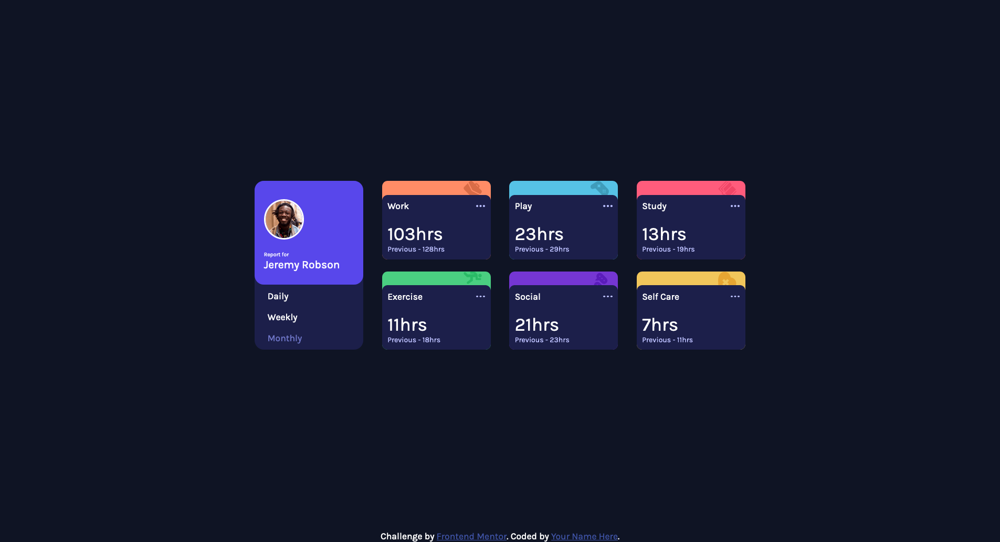

# Frontend Mentor - Time tracking dashboard solution

This is a solution to the [Time tracking dashboard challenge on Frontend Mentor](https://www.frontendmentor.io/challenges/time-tracking-dashboard-UIQ7167Jw). Frontend Mentor challenges help you improve your coding skills by building realistic projects. 

## Table of contents

- [Overview](#overview)
  - [The challenge](#the-challenge)
  - [Screenshot](#screenshot)
  - [Links](#links)
- [My process](#my-process)
  - [Built with](#built-with)
  - [What I learned](#what-i-learned)
  - [Continued development](#continued-development)
  - [Useful resources](#useful-resources)
- [Author](#author)
- [Acknowledgments](#acknowledgments)

## Overview

### The challenge

Users should be able to:

- View the optimal layout for the site depending on their device's screen size
- See hover states for all interactive elements on the page
- Switch between viewing Daily, Weekly, and Monthly stats

### Screenshot

### Links

- Solution URL: [https://github.com/nikeshnaik/time-tracking-dashboard-css](https://github.com/nikeshnaik/time-tracking-dashboard-css)
- Live Site URL: [https://stoic-haibt-174edf.netlify.app/](https://stoic-haibt-174edf.netlify.app/)

## My process

### Built with

- Semantic HTML5 markup
- CSS custom properties
- Flexbox
- CSS Grid, subGrid
- Javascript Events, localStorage

### What I learned

- When doing DOM updates, using innerHTML reconstructs DOM which removed event listener and resetup of all events is needed, solved it with building DIV section.

- Toggle Class don't work at once, need looping.

- Can use Grid even at smallest place, flexbox is good to play around in smallest area.

- Grid overrides the HTML parent and child hierarchy.

### Useful resources

- [CSS Grid Generator](https://cssgrid-generator.netlify.app/) - To build grid layout

## Author

- Website - [Nikesh Naik](https://nikeshnaik.dev)
- Frontend Mentor - [@nikeshnaik](https://www.frontendmentor.io/profile/nikeshnaik)
- Twitter - [@nikeshinfinity](https://www.twitter.com/nikeshinfinity]

